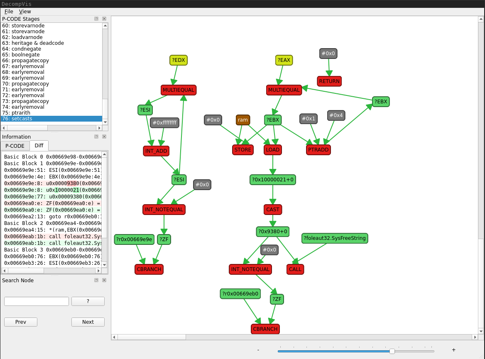

# DecompVis - Ghidra Decompilation Visualisation
DecompVis is a Python application that aims to provide insight in the internal process Ghidra's Decompiler uses to transform raw P-CODE into "high" P-CODE, which is ultimately used to provide the decompiled output.

## Background
When Ghidra needs to decompile a piece of assembly code, the code is first translated into an intermediate language, called P-CODE. At this stage, the P-CODE is also called "Raw P-CODE". P-CODE is a simple register transfer language where operations operate on variables called "Varnodes". Next, a data flow graph is constructed from these instructions, where the varnodes and operations are represented by nodes, and there is an edge between a varnode and an operation if that varnode is used as input or output for that operation.

Next, this data flow graph is simplified based on a predefined set of rules. These rules define a structure that they can simplify. If this structure exists, the rule replaces this structure by a different structure. The decompiler continuously applies these rules until no rule can be applied to the resulting data flow graph. After this process, the resulting data graph is transformed in the C tokens that constitute the final decompiled result.

Unfortunately, Ghidra provides no easy way to observe the process of transforming the data flow graph. When built with debug options, the decompiler can report on the intermediate stages, but it does so in a textual form that can be difficult to understand. This tool attempts to fill this gap and provide a way to see what transformations are applied to a data flow graph in what order to obtain the final graph.

## Usage
1. Install the dependencies using `python -m pip -r requirements.txt`.
1. Install [GraphViz](https://graphviz.org/download/).
1. Open the application using `python main.py`.
1. In the UI, click `File > Set Ghidra folder` and select the folder in which you installed Ghidra. Relative to this folder, there should be a file in the following path: `./Ghidra/Features/Decompiler/src/decompile/cpp/decomp_dbg`. If there isn't, follow the instructions at "Obtaining `decomp_dbg`". If you have set this path, it will be saved in a settings file (`settings.ini`) so you don't need to set it every time you open the application.
1. In the UI, click `File > Load XML file` and select an `.xml` file produced by Ghidra using the "Debug Function Decompilation" option.

If your project uses a custom [language definition](https://github.com/NationalSecurityAgency/ghidra/blob/master/Ghidra/Features/Base/src/main/help/help/topics/LanguageProviderPlugin/Languages.htm) from an extension not present in the ghidra installation, you will need to specify the path of a directory that contains that language definition (.ldefs file) using the -s command line option. If not certain about where to find that file, ask the developer of the extension.

## Obtaining `decomp_dbg`
First, the `decomp_dbg` executable needs to be built. This only needs to be done once (or whenever the decompiler changes) and can be done using these steps:

1. Go to the folder in which you installed ghidra.
1. Go to `./Ghidra/Features/Decompiler/src/decompile/cpp`.
1. Run `make decomp_dbg`.

After the last command has completed, an executable called `decomp_dbg` should have been created in the folder. Once you have this, you can start using DecompVis.

## Limitations
Currently, this project has several limitations, which future commits will (hopefully) address and mitigate.

1. **Rendering Performance**. Perhaps the biggest limitation lies in the performance of rendering the reconstructed data flow graph. The more instructions the initial assembly has, the larger the reconstructed data flow graph. As such, it is advisable to try to limit the size of the functions that are fed into the program as much as possible.
1. **Inaccurate Data Flow Graph Reconstruction - Incomplete Graph**
The intermediate graphs that this program produces are generated based on a diff that the `decomp_dbg` program provides for every intermediate step. However, it seems that these diffs are incomplete. This causes some nodes to not be connected, which leads to an inaccurate reconstructed data flow graph. An issue (NationalSecurityAgency/ghidra#4963) has been created to resolve this problem in Ghidra. Until this issue is resolved, this program uses a workaround, where the sequence number (the `10` in `0x800e2e58:10`) of addresses is ignored.
1. **Inaccurate Data Flow Graph Reconstruction - Ambiguous Operators**. The format used by `decomp_dbg` to print the P-CODE is ambiguous for various common operations (for example, the `*` symbol can denote both `INT_MULT` and `FLOAT_MULT`). This is undesirable, because for proper understanding of the data flow graph, it is necessary to know exactly which P-CODE operations are present. Since this limitation is caused by Ghidra, a PR (NationalSecurityAgency/ghidra#5063) has been created to resolve these ambiguities. Until this issue is resolved, this program supports alternative, unofficial operators. These are shown in the table below.

## Unofficial operators
The table below contains all (10) ambiguous operators that are printed by `TypeOp::printRaw`, as well as several unofficial operators that would be used to uniquely identify the ambiguous operations.

Operator        | Operation
---             | ---
`-` (unary)     | `INT_2COMP`
`f-` (unary)    | `FLOAT_NEG`
`==`            | `INT_EQUAL`
`f==`           | `FLOAT_EQUAL`
`!=`            | `INT_NOTEQUAL`
`f!=`           | `FLOAT_NOTEQUAL`
`<`             | `INT_LESS`
`s<`            | `INT_SLESS`
`f<`            | `FLOAT_LESS`
`<=`            | `INT_LESSEQUAL`
`s<=`           | `INT_SLESSEQUAL`
`f<=`           | `FLOAT_LESSEQUAL`
`+`             | `INT_ADD`
`f+`            | `FLOAT_ADD`
`-`             | `INT_SUB`
`f-`            | `FLOAT_SUB`
`*`             | `INT_MULT`
`f*`            | `FLOAT_MULT`
`/`             | `INT_DIV`
`s/`            | `INT_SDIV`
`f/`            | `FLOAT_DIV`
`%`             | `INT_REM`
`s%`            | `INT_SREM`
